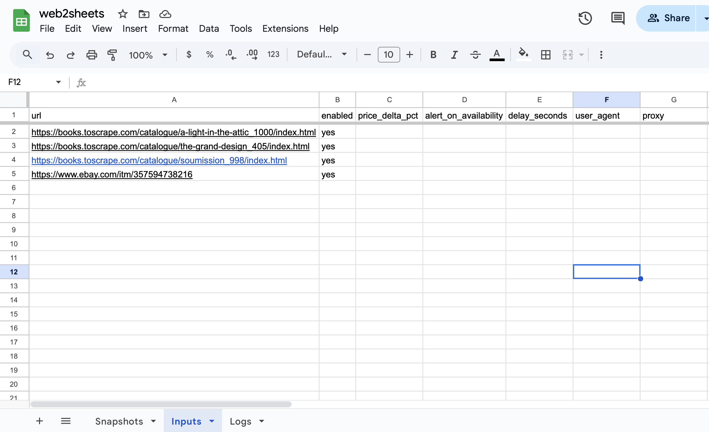

# web2sheets-tracker

A Python service that tracks product prices and availability on websites, writes snapshots to Google Sheets, and sends alerts via Telegram or Email.

## Features
- 🧩 Provide pluggable adapters (BooksToScrape, eBay)
- 🗂 Use Google Sheets as a source of truth (Inputs, Logs, Snapshots)
- 🔔 Send alerts via Telegram & Email (SMTP)
- 📊 Generate daily digest (manual & scheduled)
- 🧪 Export data as CSV
- 🌐 Support per-URL proxy & user-agent overrides
- 🖥 Offer a Streamlit dashboard (MVP)

## Demo

### Streamlit Dashboard
Screenshots showing the interactive dashboard for monitoring prices and availability.


### Google Sheets
Examples of the Google Sheets used for inputs, snapshots, and logs.



## Installation
```bash
git clone https://github.com/voprosovnety/web2sheets-tracker.git
cd web2sheets-tracker
python -m venv .venv && source .venv/bin/activate
pip install -r requirements.txt
```

## Usage
```bash
# Run once to fetch and write data to the sheet
python -m src.main run_list --write-to-sheet
```

```bash
# Schedule daily digest notifications
python -m src.main schedule_daily_digest
```

```bash
# Export snapshots to a CSV file
python -m src.main export_csv --out snapshots.csv
```

```bash
# Launch the Streamlit dashboard
PYTHONPATH=. streamlit run src/dashboard.py
```

## .env Example
Note: Set `GOOGLE_SHEET_ID` from your own Google Sheet.
```env
GOOGLE_SHEET_ID=your-google-sheet-id
WRITE_ON_CHANGE_ONLY=true
NOTIFY_EMAIL=false
DIGEST_HOURS_DEFAULT=24
DAILY_DIGEST_TIME=09:00
DIGEST_NOTIFY_TELEGRAM=true
DIGEST_NOTIFY_EMAIL=false
EXPORT_DEFAULT_SHEET=Snapshots
```

## Project Catalog pitch
> Set up a Python price/stock tracker that writes to Google Sheets and notifies you on changes (Telegram/Email). Includes a clean Streamlit dashboard and CSV exports. Per-URL proxy & user-agent supported.